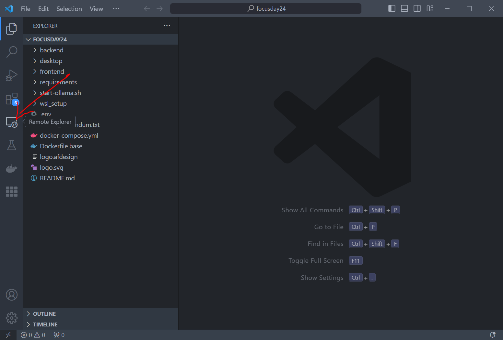
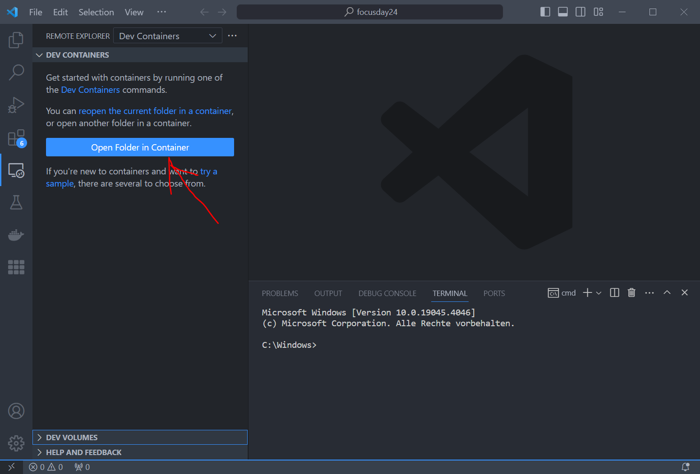
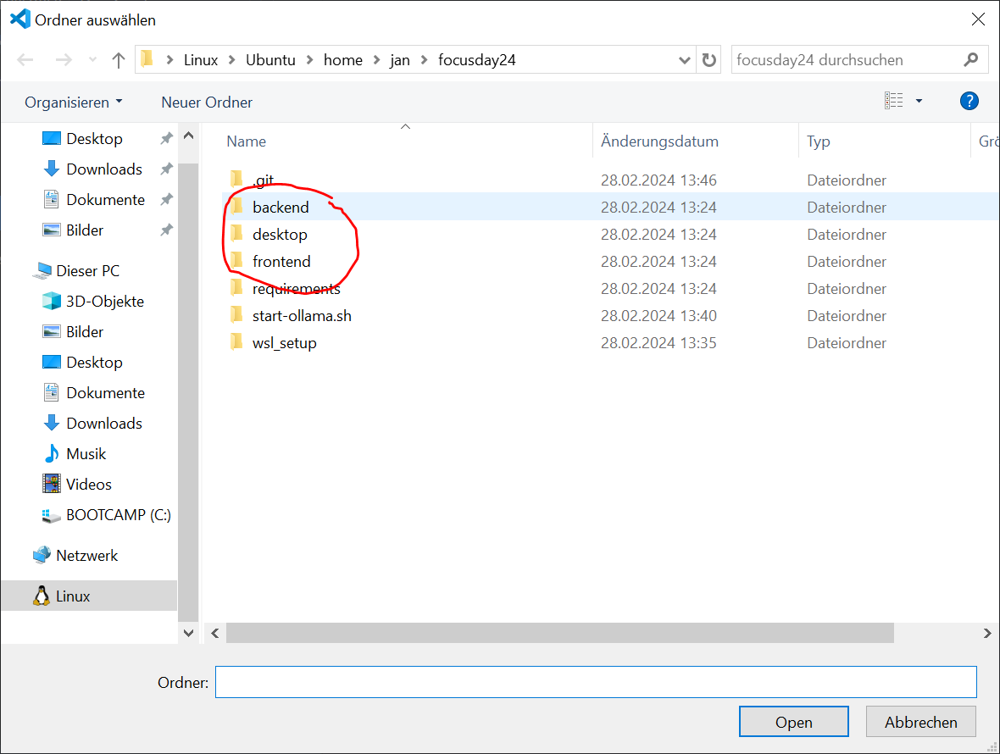
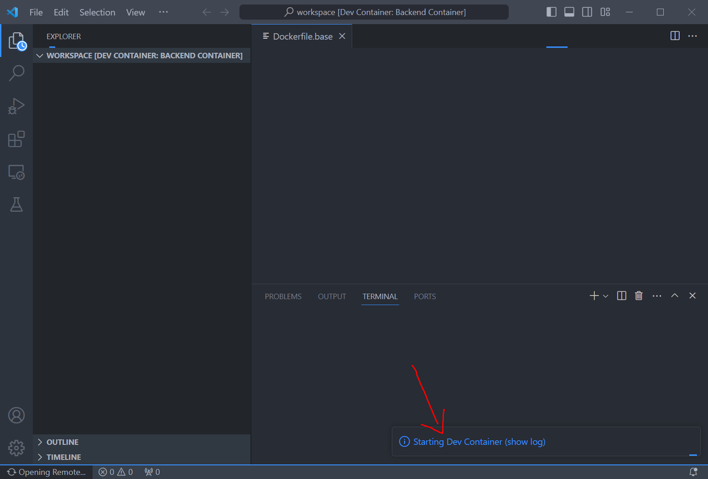

# bbv Time Tracker

Die bbv hat den PMWeb – ein praktisches Tool zum Loggen deiner Arbeitszeiten und Projekte. Doch was ihm fehlt ist ein schnelles Zeittracking. Wir möchten verhindern, dass du dich am Ende des Tages an all die Dinge, die du gemacht hast, zurückerinnern musst. Damit es einfacher wird die Zeiterfassung in deinen Workflow zu integrieren, bauen wir eine kleine einfache Applikation zur Zeiterfassung mit Hilfe von Generative AI.

Das Projekt ist eine Full-Stack Web-Applikation. Dafür braucht es ein hübsches Frontend, eine Datenbank und einen Webserver, der beides miteinander verbindet.


# Dev Setup
Damit wir alle denselben Startpunkt haben, nutzen wir in diesem Projekt Docker, Visual Studio Code und arbeiten in Dev Containers. So haben wir einige für die Entwicklung benötigte und praktische Services, die man nicht im eigenen Betriebssystem zum Laufen bringen muss.

Wähle hier dein Betriebssystem aus:

## Windows

Als Teil des Setups:

1. Visual Studio Code direkt durch den Microsoft Store installieren
2. [WSL installieren](./wsl_setup/installWSL_de.md)
3. [Docker Desktop](https://docs.docker.com/desktop/install/windows-install/) über den Installer installieren und die Applikation starten
4. Den Root-Ordner dieser Git-Repo in einem WSL Terminal öffnen
5. Mithilfe von `code .` diesen Ordner in Visual Studio Code öffnen

Alternativ kann sowohl VSCode als auch die Docker Engine direkt in der WSL2 installiert werden. Danach einfach den untenstehenden Anweisungen weiter folgen.

## macOS

Als Teil des Setups:

1. [Visual Studio Code installieren](https://code.visualstudio.com/docs/setup/mac)
2. [Docker Desktop installieren](https://docs.docker.com/desktop/install/mac-install/)

Später, falls du alles löschen möchtest:
1. [Visual Studio Code deinstallieren](https://code.visualstudio.com/docs/setup/uninstall#_macos)
2. [Docker Desktop deinstallieren](https://docs.docker.com/desktop/uninstall/)

## Linux

Als Teil des Setups:

1. [Docker installieren](https://docs.docker.com/engine/install/)
2. [VSCode installieren](https://code.visualstudio.com/docs/setup/linux)

Später, falls du alles löschen möchtest:

1. [Docker deinstallieren](./markdown/remove_docker.md)
2. [Visual Studio Code deinstallieren](https://code.visualstudio.com/docs/setup/uninstall)

## Code Setup in Visual Studio Code

Damit wir nicht unnötig Code duplizieren, haben wir einen Basis Docker Container erstellt. Bevor du loslegen kannst, musst du diesen als allererstes bauen. Gehe dafür im Terminal in den Root-Ordner der Git Repository und führe folgenden Befehl aus:

```
docker-compose build focusday24
```

Du kannst diesen Befehl und die nachfolgenden auch direkt im Visual Studio Code Terminal ausführen. Wenn du Visual Studio Code in Windows über ein WSL Terminal gestartet hast, werden die Terminals innerhalb von Visual Studio Code ebenfalls im WSL ausgeführt. Das macht die Sache bequemer.

Dir sollte nun unten rechts im Notification-Bereich von Visual Studio Code die Installation einiger Extensions angeboten werden. Darunter auch die Dev Containers Extension, womit der aktuelle Ordner im Kontext eines Docker Containers geöffnet werden kann. Nach der Installation der Extension solltest du Visual Studio Code neustarten. Danach kann es losgehen.

Du wirst ganz links im Visual Studio Code-Fenster einige Icons sehen, darunter wird der Remote Explorer sein:



Klicke im Remote Explorer den Button *Open Folder in Container*:

Falls dieser Button nicht erscheint, weil bereits andere Dev-Containers vorhanden sind, öffne die Command-Palette mit `Ctrl + Shift + P` und gib den Befehl `Dev Containers: Open Folder in Container...` ein.



Wähle daraufhin einen der drei Projektordner aus:



Und Visual Studio Code sollte übrigen Container dann automatisch bauen und starten!



Folgende Services stehen daraufhin zur Verfügung:
| Service | Kommentar | URI/URL |
|---------|-----------|---------|
| MongoDB | Eine NoSQL DB. Es ist dir überlassen ob du sie nutzen willst | mongodb://localhost:27017 |
| SQLiteDB | Eine SQL DB. Es ist dir überlassen ob du sie nutzen willst | sql://localhost:1433 |
| Swagger UI | Ein Tool zum testen deines Backend Servers | http://localhost:8001/swagger |
| JSON Mock Server | Ein Tool, das Testdaten für dein Frontend liefert | http://localhost:8002 |

## Ordnerstruktur

Das Projekt ist eine Monorepo für Frontends und Backend zugleich. Das ist für den Fall, dass du beides machen möchtest, und hält den Code fürs ganze Projekt in einem Paket. Hier eine kurze Übersicht.

```bash
├── README.md
├── docker-compose.yml
├── Dockerfile.base
├── backend
│   ├── Dockerfile
│   └── README.md
├── desktop
│   ├── Dockerfile
│   └── README.md
├── frontend
│   ├── Dockerfile
│   └── README.md
└── requirements
    └── openapi.json
```

Du kannst jeden dieser Ordner in VSCode als Workspace öffnen und mit <kbd>Ctrl+Shift+P</kbd> den Command `Dev Containers: Open Folder in Container` ausführen. VSCode wird die Dev Container anhand der `docker-compose.yaml` und dem `Dockerfile` im ensprechenden Ordner bauen und ausführen. Nun ist das Sub-Projekt in einem Docker Container geöffnet und dir stehen die fürs Projekt relevanten oben genannten Services zur Verfügung!

## Wechseln des Dev-Containers
Im Moment kannst du nicht gleichzeitig an zwei Projekten arbeiten. Wenn du zum Beispiel vom Frontend zum Backend wechseln möchtest, führe folgende Befehle aus:
- `docker rm backend_container` (möchtest du in den Desktop-Container wechseln, `docker rm desktop_container`, oder `docker rm backend_container` möchtest du in den Backend-Container wechseln)
- Starte in der Command Palette (<kbd>Ctrl+Shift+P</kbd>) den Befehl "Dev Containers: Open Folder in Container" und wähle den gewünschten Ordner

# Lokales LLM mit Ollama nutzen
Mit der `docker-compose.yml` haben wir bereits einen Container bereitgestellt, der einen Ollama-Server ausführt. Dieser stellt dir verschiedene LLMs bereit, die lokal auf Ihrem Rechner laufen können. Welche Modelle du ausprobieren möchtest, liegt bei dir. Aber um sie herunterzuladen, müsstest du in den Ollama-Container gelangen. Wenn es dir gelungen ist, einen Dev Container in Visual Studio Code zu starten, läuft der Ollama-Server höchstwahrscheinlich bereits. Du kannst dies mit `docker ps` überprüfen, und solltest eine Ausgabe sehen, die der folgenden ähnlich ist

```
124dd9792e33   vsc-frontend-96429014f6dcf423a47e266e54c469d462141342ea736f8ae3512315aba8bcba-uid   "/bin/sh -c 'echo Co…"   13 seconds ago   Up 11 seconds   0.0.0.0:8003->6734/tcp, :::8003->6734/tcp           frontend_container
de98d339ea20   swaggerapi/swagger-ui                                                               "/docker-entrypoint.…"   15 seconds ago   Up 14 seconds   80/tcp, 0.0.0.0:8001->8080/tcp, :::8001->8080/tcp   swagger_ui_container
8fd8d6e8407f   mongo:latest                                                                        "docker-entrypoint.s…"   15 seconds ago   Up 13 seconds   27017/tcp                                           mongodb_container
82a7e89a5ed9   ollama/ollama:latest                                                                "/bin/ollama serve"      15 seconds ago   Up 13 seconds   0.0.0.0:11434->11434/tcp, :::11434->11434/tcp       ollama
```

Mit `docker exec -it ollama /bin/bash` kannst du eine Shell innerhalb des Containers erhalten. Für die verfügbaren Modelle siehe [hier](https://ollama.com/library). Wähle die Größe des Modells entsprechend des Computers, mit dem du arbeitest, und lade zum Beispiel das neueste Modell von Google mit `ollama pull gemma:2b` herunter. Um sicherzustellen, dass die Modelle erhalten bleiben, verwenden wir ein Docker-Volume namens `ollama`.

# Setup von lokalem Code Assistenten

Es gibt viele Copilot-Plugins für Visual Studio Code. Hier unsere Favoriten:

## [Continue](https://continue.dev/)

[Video der Anwendung](https://www.youtube.com/watch?v=3Ocrc-WX4iQ&t=2s)

### Settings

Um die Modelle im Ollama-Container zu verwenden, kannst du Modelle zu Continue hinzufügen, indem du einfach im Plugin-Tab auf die Schaltfläche `+` drückst, Ollama als Anbieter auswählst und die Autodetektion verwendest.

Ein Vorteil von Continue ist, dass es auch kommerzielle Modelle verwendet werden kann und der Einrichtungsprozess recht einfach ist.

## [Twinny](https://marketplace.visualstudio.com/items?itemName=rjmacarthy.twinny)

### Settings

Mit `Ctrl+Shift+P` werden die User Settings über `Preferences: Open User Settings (JSON)` geöffnet. Das Folgende dann der Konfiguration hinzufügen:

```
"twinny.apiHostname": "ollama",
"twinny.fimModelName": "model1",
"twinny.chatModelName": "model2"
```

Die erste Einstellung sorgt dafür, dass wir mit dem im Dev Container laufenden Ollama Server kommunizieren. Die anderen zwei welche Modelle wir verwenden. Es können somit zwei unterschiedliche Modelle für den Chat und die Code Vorschläge verwendet werden (FIM: Fill in the middle).

# Hinweise zum Coden mit einem einem KI Agenten (AI Hub, ChatGPT, Bard etc)

Tipps und Hinweise zum Coden (auch ohne KI):

| Tipp                                             | Beschreibung                                                                                                                                                                                                                                |
|--------------------------------------------------|---------------------------------------------------------------------------------------------------------------------------------------------------------------------------------------------------------------------------------------------|
| Erkläre detailreich und mit Beispielen           | Gehe nicht davon aus, dass die KI deine Anforderungen ohne detaillierte Informationen und Beispiele versteht. Je genauer du dein Anliegen erklärst, desto besser kann die KI darauf eingehen.                                               |
| Nutze die KI zur Interface-Definition            | Definiere klar die Schnittstellen für deine Projekte. Gib der KI spezifische Anweisungen, welche Methoden und Eigenschaften erwartet werden, um die Implementierung zu erleichtern.                                                         |
| Arbeite nach TDD/BDD                             | Implementiere Test-Driven Development (TDD) oder Behavior-Driven Development (BDD), indem du zuerst Tests schreibst, die dein erwartetes Ergebnis definieren. Fordere die KI auf, dir beim Erstellen dieser Testspezifikationen zu helfen.  |
| Frage nach Randfällen und generiere Tests        | Erkundige dich bei der KI nach möglichen Randfällen, die dein Code berücksichtigen sollte. Bitte um Hilfe bei der Generierung von Tests, die diese Fälle abdecken, um die Robustheit deiner Anwendung zu erhöhen.                           |
| Refactoring mit KI-Unterstützung                 | Nutze die KI, um deinen Code effizienter zu gestalten. Bitte um Vorschläge für das Refactoring und überprüfe, ob die Tests nach den Änderungen immer noch bestehen, um die Integrität deines Codes zu wahren.                               |
| Unterbreche die Aufgabe in kleinere Funktionen   | Statt ganze Klassen auf einmal zu definieren, teile das Problem in kleinere, handhabbare Funktionen auf. Gib der KI spezifische Aufgaben und lasse sie die notwendigen Funktionen schreiben.                                                |
| Fordere Rückfragen bei Unsicherheiten            | Wenn du den Eindruck hast, dass die KI deine Anforderungen nicht vollständig versteht, ermutige sie, nachzufragen oder um mehr Informationen zu bitten. Dies kann zu präziseren und nützlicheren Antworten führen.                          |
| Gib ein Antwortformat vor                        | Definiere, wie du die Antworten der KI erhalten möchtest. Dies kann die Klarheit und Nützlichkeit der erhaltenen Informationen verbessern und sicherstellen, dass sie deinen Erwartungen entsprechen.                                       |
| Iteriere deine Prompts                           | Wenn die erste Antwort nicht zufriedenstellend ist, zögere nicht, deine Frage zu überarbeiten und erneut zu stellen. Durch Iteration kannst du präzisere und hilfreichere Antworten von der KI erhalten.                                    |
| Spezifiziere Programmiersprache und Framework    | Um relevante und genaue Unterstützung zu erhalten, teile der KI die spezifischen Technologien mit, die du verwendest, einschließlich der Programmiersprache und des Frameworks.                                                             |
| Nutze das Web für Kontext und Informationen      | In manchen Fällen kann es hilfreich sein, die KI anzuweisen, das Web zu nutzen, um zusätzliche Kontextinformationen zu sammeln oder um aktuelle Entwicklungen und Best Practices in der Softwareen
