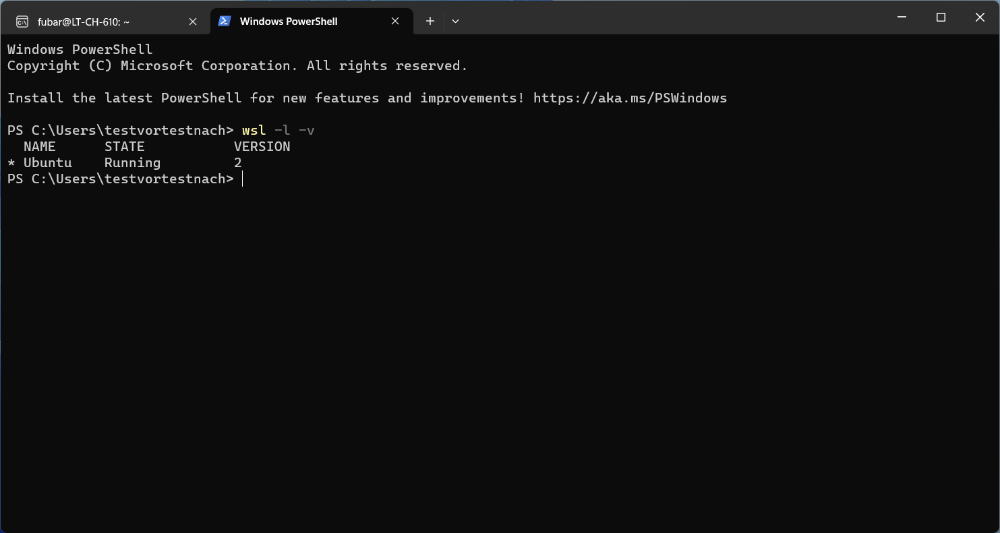

## WSL
Die Vorbereitung besteht aus der Installation von WSL2 (Windows Subsystems für Linux) auf deinem standardmässig ausgegebenen bbv Laptop. Keine Sorge, sollte nicht lange dauern.

Solltest du bei den nachfolgenden Schritten auf Probleme stossen, [hier ist ein guter Guide](https://pureinfotech.com/install-windows-subsystem-linux-2-windows-10/) mit dem auch ältere Windows 10-Versionen abgedeckt sind. Neue Windows 10 Versionen (z.B. 21H2) und Windows 11 sollten einfach so funktionieren.

**1. Öffne das Terminal als Administrator**


Falls auf Windows 10 das Terminal nicht installiert ist, funktioniert auch Windows PowerShell oder cmd.

**2. Installiere Windows Subsystem for Linux**


Solange in Windows die entsprechenden Abhängigkeiten installiert sind (wie bei einer unmodifizierten Windows Pro-Installation üblich), wird `wsl --install` Windows Subsystem for Linux installieren.

Eine erfolgreiche Installation wird folgenden Output zeigen:


Wenn bis hierhin alles gut gelaufen ist, solltest du WSL und die von Microsoft empfohlene Standard Ubuntu-Distribution installiert haben. Der Installer wird auch die notwendigen Systemeinstellungen automatisch gemacht haben.

**3. Neustart**

Starte Windows jetzt neu. Nach dem Neustart sollte im Terminal nun eine neue Art von Terminal mit dem Namen `Ubuntu` angezeigt werden. Das ist das WSL Terminal für die vorhin installierte Distribution.

**4. Hinzufügen eines Standardbenutzers**


Beim ersten Einloggen in WSL sollte das Terminal automatisch geöffnet werden. Du wirst mit der Aufforderung begrüsst einen neuen UNIX-Benutzernamen zu erstellen. Dies ist ein Benutzer, der keine Verbindung zu deinen Windows-Anmeldeinformationen oder zum Unternehmensverzeichnis hat. Daher kannst du den Benutzernamen frei wählen.

Danach wirst du aufgefordert ein Passwort für deinen neuen Benutzer zu erstellen. Dieses Passwort wird jedes Mal benötigt, wenn du neue Software installieren oder Systemeinstellungen in WSL ändern möchtest. Vergiss es nicht oder speichere es in deinem Passwortmanager.

Nach erfolgreichem Abschluss solltest du mit einer entsprechenden Meldung begrüsst und die bash-Aufforderung angezeigt werden.


**5. Überprüfe die WSL-Version**

Es kann sein, dass Windows automatisch WSL 1 installiert. Das kommt mit einigen Einschränkungen, die es mit WSL 2 nicht gibt. Daher, kontrolliere nach der Installation noch kurz die WSL Version mit:

```
wsl -l -v
```



Unter **VERSION** sollte `2` stehen. Falls dort `1` steht, führe folgenden Befehl aus um WSL auf Version 2 upzudaten:

```
wsl –update
```

Nun kannst du [hier](../README.md#Code-Setup-in-Visual-Studio-Code) weiter den Schritten für die Einrichtung des Dev Containers in VSCode einrichten.