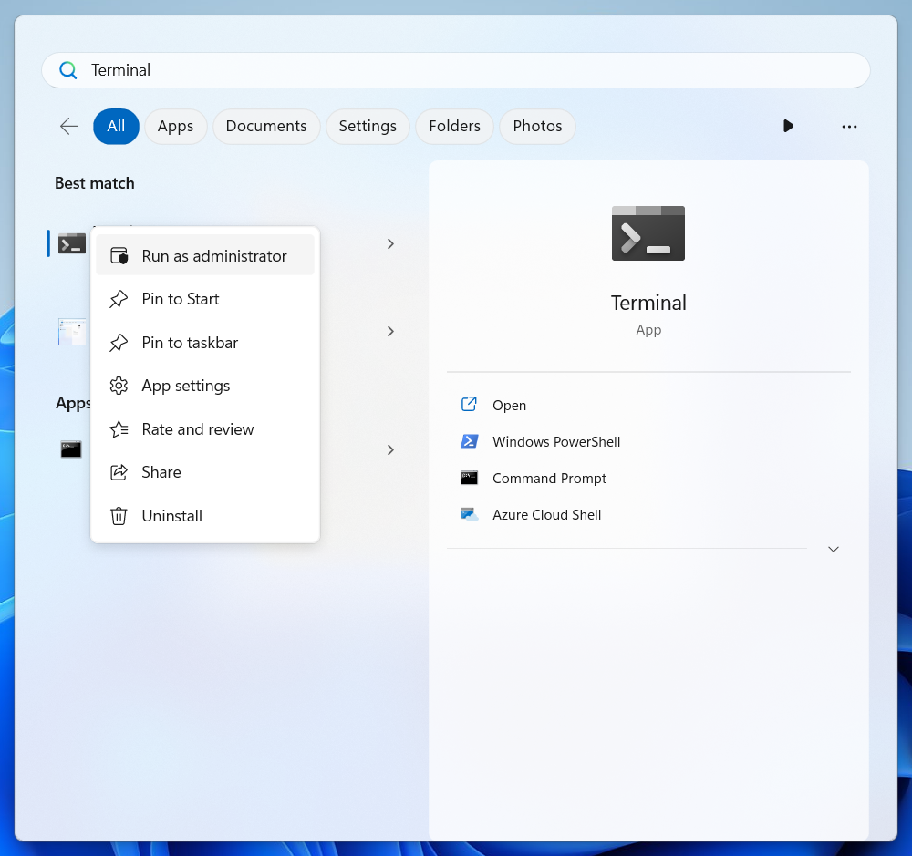
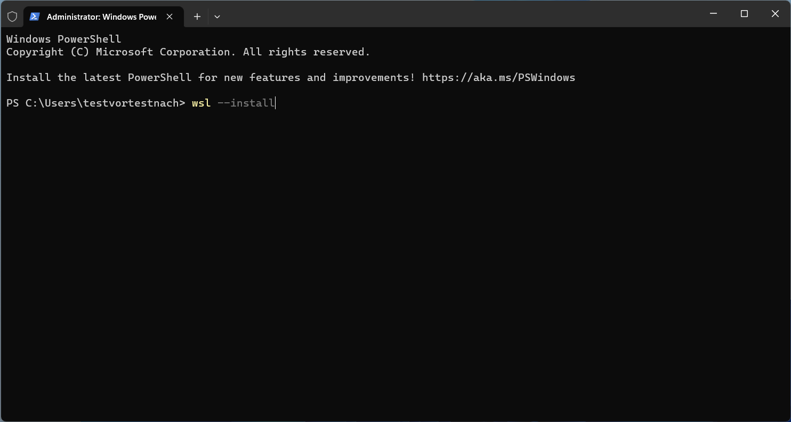
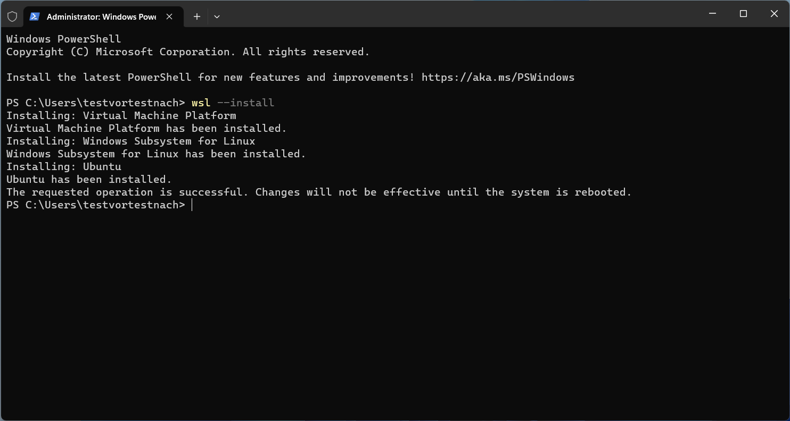
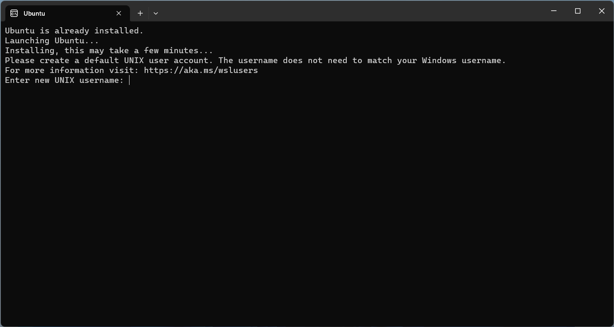
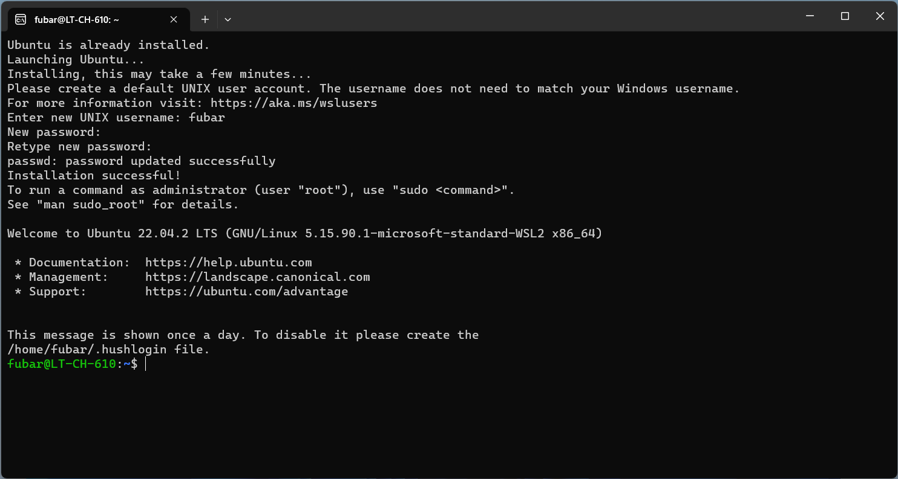

## WSL
Preparation involves the installation of WSL2 (Windows Subsystem for Linux) on your default bbv laptop. Don't worry, it shouldn't take long.

If you encounter any issues in the following steps, [here is a helpful guide](https://pureinfotech.com/install-windows-subsystem-linux-2-windows-10/) that also covers older Windows 10 versions. New Windows 10 versions (e.g. 21H2) and Windows 11 should work smoothly.

**1. Run the Terminal as Administrator**



If the Terminal is not installed on Windows 10, Windows PowerShell or cmd will also work.

**2. Install Windows Subsystem for Linux**



As long as the necessary dependencies are installed in Windows (as usual in an unmodified Windows Pro installation), the following command will install Windows Subsystem for Linux:

```
wsl --install
```

A successful installation will show the following output:



If everything has gone well so far, you should have WSL and the Microsoft-recommended default Ubuntu distribution installed. The installer will also have made the necessary system settings automatically.

**3. Reboot**

Reboot Windows now. After the reboot, a new type of terminal named `Ubuntu` should appear in the terminal app. This is the WSL terminal for the Linux distribution installed earlier.

**4. Add a default user**



Upon first login to WSL, the terminal should open automatically. You will be prompted to create a new UNIX username. This is a user that has no connection to your Windows login credentials or the corporate directory. Therefore, you can freely choose the username.

Next, you will be prompted to create a password for your new user. This password will be required each time you want to install new software or change system settings in WSL. Don't forget it or save it in your password manager.

Upon successful completion, you should be greeted with a corresponding message, and the bash prompt should appear.



**5. Check the WSL version**

Windows may automatically install WSL 1. This comes with some limitations that are not present in WSL 2. Therefore, after installation, briefly check the WSL version with:

```bash
wsl -l -v
```

Under **VERSION**, it should say `2`. If it says `1`, execute the following command to update WSL to version 2:

```
wsl –update
```

Now, please continue with setting up the Dev Container in VSCode here.

Testing this!